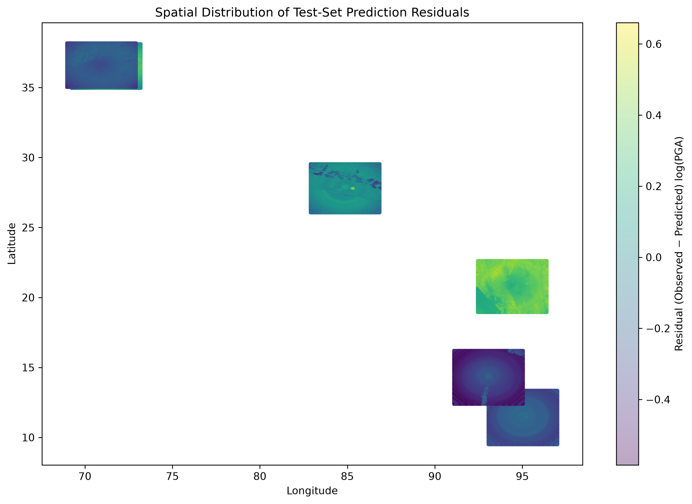
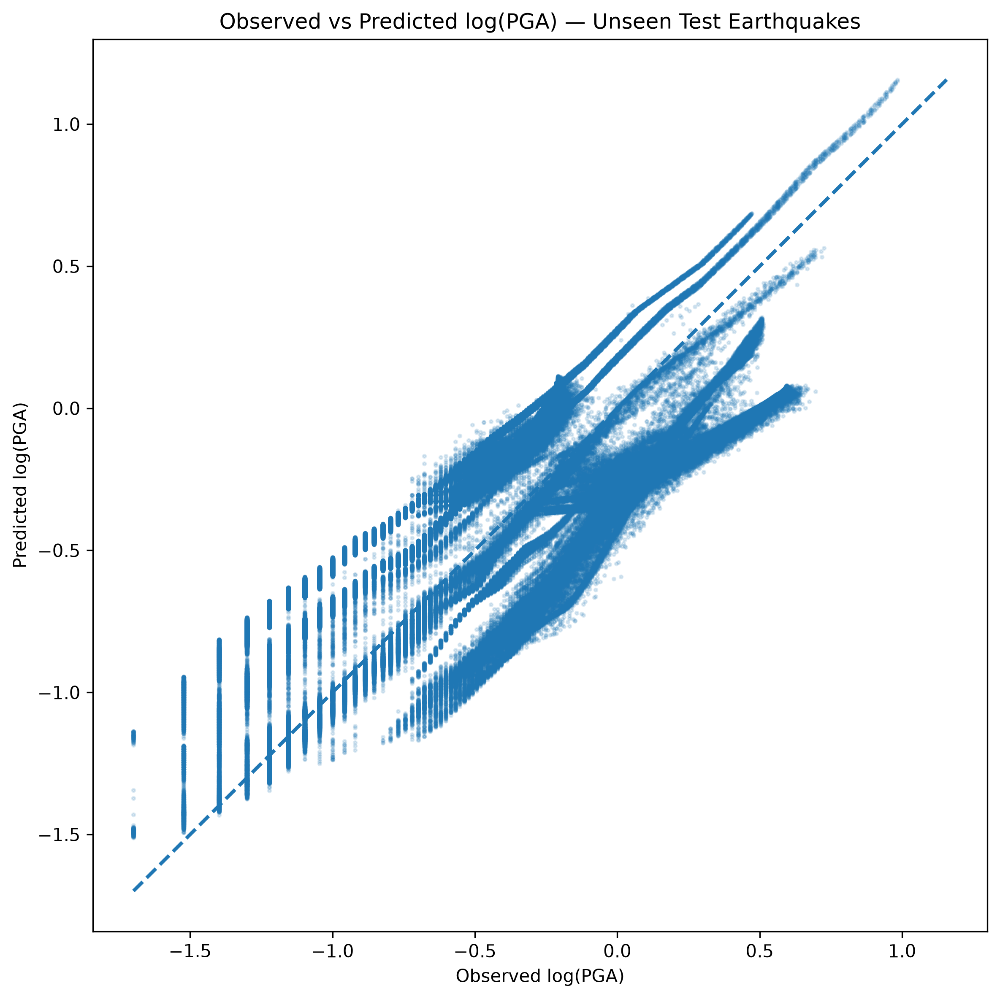
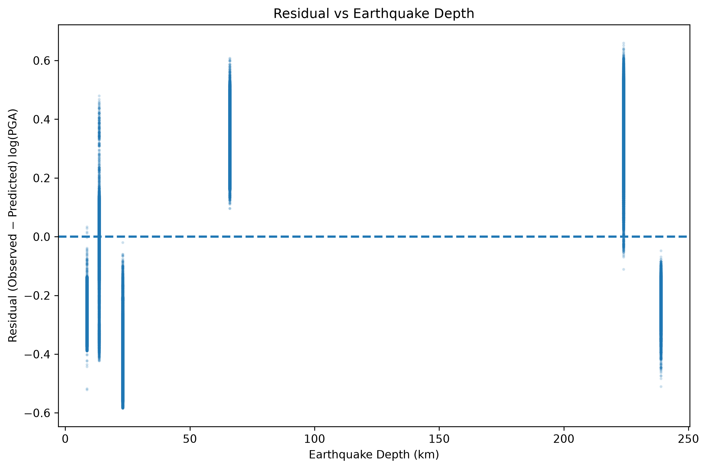

# 🌎 Earthquake Ground-Motion Prediction

### Machine Learning + Deep Learning for Earthquake Ground-Motion Estimation

[](https://earthquake-ground-motion-ml-c3ebpb3tww8ybtwgq2vdu.streamlit.app/)
[](https://www.python.org/)
[](https://pytorch.org/)
[](https://scikit-learn.org/)
[](https://lightgbm.readthedocs.io/)
[](https://streamlit.io/)

> An end-to-end scientific machine-learning system for predicting earthquake ground motion from earthquake source parameters, propagation geometry, geographic information, and site conditions.

**2.87M+ observations · 40 earthquakes · 13 final features · 4 model families · Earthquake-grouped validation · Unseen-earthquake testing · Interactive deployment**

---

## 🚀 Live Demo

[**Open the deployed Streamlit app →**](https://earthquake-ground-motion-ml-c3ebpb3tww8ybtwgq2zvdu.streamlit.app/)

The deployed application provides:

- 🌎 Earthquake-level performance exploration
- 📊 Model comparison
- 🔍 Permutation feature importance
- 📈 Model response analysis
- 🗺️ Spatial ground-motion visualization
- 🎯 Interactive PGA prediction

---

# 📌 Project Overview

Earthquake ground-motion prediction is a regression problem where the objective is to estimate the intensity of seismic shaking at a location given earthquake source characteristics, propagation geometry, and local site conditions.

This project predicts:

```text
logarithmic Peak Ground Acceleration (log-PGA)
```

using:

- Earthquake source parameters
- Source-to-site distances
- Geographic coordinates
- Vs30 site conditions
- Physically motivated feature interactions

The project was designed as a complete geoscience + machine-learning workflow rather than simply training a single predictive model.

```text
Earthquake Data
      ↓
Data Acquisition & Quality Control
      ↓
ShakeMap Processing
      ↓
Geological / Vs30 Integration
      ↓
Exploratory Data Analysis
      ↓
Physical Feature Engineering
      ↓
Classical ML Baselines
      ↓
Deep Learning
      ↓
Earthquake-Grouped Cross-Validation
      ↓
Completely Unseen Earthquake Testing
      ↓
Residual Analysis
      ↓
Interpretability
      ↓
Streamlit Deployment
```

---

# 📊 Project Snapshot

| Component | Result |
|---|---:|
| Ground-motion observations | **2.87M+** |
| Earthquake events | **40** |
| Final model features | **13** |
| Modeling approaches | **4** |
| Training earthquakes | **28** |
| Validation earthquakes | **6** |
| Completely unseen test earthquakes | **6** |
| Best grouped-CV R² | **0.8015** |
| Unseen-earthquake R² | **0.6099** |
| Final model | **PyTorch MLP** |
| Deployment | **Streamlit Cloud** |

---

# 🎯 Problem Statement

Peak Ground Acceleration (PGA) is an important measure of earthquake ground shaking.

The objective is to learn the relationship between:

```text
Earthquake Source
       +
Propagation Geometry
       +
Site Conditions
       +
Geographic Information
       ↓
Observed Ground Motion
```

and predict:

```text
log10(PGA)
```

The model output is converted back to PGA for the deployed application.

---

# 🌍 Scientific Background

Ground motion depends on several interacting factors.

### Earthquake Source

- Magnitude
- Event depth

### Propagation

- Epicentral distance
- Hypocentral distance
- Distance attenuation

### Site Conditions

- Vs30
- Site classification
- Availability of Vs30 information

### Geographic Effects

- Latitude
- Longitude

The relationship between these variables is nonlinear and event-dependent, making the problem suitable for comparing linear models, tree-based models, and neural networks.

---

# 📊 Dataset

The integrated dataset contains approximately:

- **2.87 million observations**
- **40 earthquake events**
- Spatial ground-motion observations
- Earthquake metadata
- ShakeMap measurements
- Vs30 site information

The integrated dataset contains 26 columns:

```text
grid_lon
grid_lat
PGA
PGV
MMI
PSA03
PSA10
PSA30
event_id
magnitude
event_lat
event_lon
epicentral_distance_km
hypocentral_distance_km
event_depth
Vs30
Vs30_clean
site_class
log_PGA
log_distance
log_epicentral_distance
magnitude_distance_interaction
magnitude_squared
depth_distance_interaction
log_Vs30
Vs30_available
```

---

# 🔬 Why Earthquake-Level Validation?

A random row-wise train/test split would be inappropriate for this dataset.

A single earthquake can generate thousands of spatial observations. Those observations share:

- Magnitude
- Depth
- Source characteristics
- Propagation structure
- Regional effects
- Event-specific patterns

Therefore, observations from the same earthquake should not be freely distributed across training and validation sets.

Instead, entire earthquakes are grouped together.

```text
                    40 Earthquakes
                          │
          ┌───────────────┼───────────────┐
          │               │               │
       Training       Validation        Final Test
       28 events       6 events         6 events
          │               │               │
          └───────────────┴───────────────┘
                          │
             Completely unseen events
```

The final test therefore evaluates whether the model can generalize to earthquake events that were never observed during model development.

---

# 🧠 Feature Engineering

The final PyTorch MLP uses 13 features:

```text
magnitude
event_depth
epicentral_distance_km
hypocentral_distance_km
log_distance
magnitude_squared
magnitude_distance_interaction
depth_distance_interaction
Vs30_clean
log_Vs30
Vs30_available
grid_lat
grid_lon
```

## Logarithmic Distance

```text
log_distance = log10(hypocentral_distance)
```

This represents distance over a more suitable logarithmic scale for attenuation behavior.

## Magnitude Nonlinearity

```text
magnitude_squared = magnitude²
```

This allows the baseline models to represent nonlinear magnitude effects.

## Magnitude-Distance Interaction

```text
magnitude_distance_interaction
    = magnitude × log_distance
```

This allows the effect of distance to vary with earthquake magnitude.

## Depth-Distance Interaction

```text
depth_distance_interaction
    = event_depth × log_distance
```

## Vs30 Transformation

```text
log_Vs30 = log10(Vs30)
```

A separate availability indicator is retained:

```text
Vs30_available
```

This distinguishes observed Vs30 values from missing/imputed site information.

---

# 🤖 Models Compared

Four model families were evaluated.

## 1. Elastic Net

A regularized linear regression baseline using L1 and L2 regularization.

## 2. Physical Elastic Net

A linear model using physically motivated engineered features.

## 3. LightGBM

A nonlinear gradient-boosted decision-tree model.

## 4. PyTorch MLP

The final deep-learning model.

### Architecture

```text
Input
13 features
    │
    ▼
Linear(13 → 64)
    │
    ▼
Batch Normalization
    │
    ▼
Activation
    │
    ▼
Linear(64 → 32)
    │
    ▼
Batch Normalization
    │
    ▼
Activation
    │
    ▼
Linear(32 → 16)
    │
    ▼
Activation
    │
    ▼
Linear(16 → 1)
    │
    ▼
Predicted log-PGA
```

The trained model is stored in:

```text
models/pga_mlp_development.pt
```

---

# 🏆 Model Performance

## Earthquake-Grouped 5-Fold Cross-Validation

| Model | RMSE | MAE | R² |
|---|---:|---:|---:|
| 🥇 **PyTorch MLP** | **0.2128** | **0.1777** | **0.8015** |
| Elastic Net | 0.2474 | 0.2080 | 0.7317 |
| Physical Elastic Net | 0.2999 | 0.2353 | 0.6021 |
| LightGBM | 0.3169 | 0.2385 | 0.5579 |

### Best model

```text
PyTorch MLP

RMSE = 0.2128
MAE  = 0.1777
R²   = 0.8015
```

---

# 🌎 Completely Unseen-Earthquake Test

The final evaluation uses six earthquake events that were completely excluded from model development.

| Metric | Unseen-Earthquake Test |
|---|---:|
| RMSE | **0.3113** |
| MAE | **0.2800** |
| R² | **0.6099** |

The difference between grouped cross-validation and unseen-event performance is intentionally reported.

```text
Grouped CV R²
     0.8015
        ↓
Unseen Test R²
     0.6099
```

This demonstrates that generalizing to entirely new earthquake events is substantially harder than interpolation within the development distribution.

---

# 🔍 Model Interpretability

The final model is analyzed using permutation feature importance.

The strongest contributors include:

1. Event depth
2. Depth-distance interaction
3. Log distance
4. Log Vs30
5. Vs30
6. Geographic coordinates
7. Hypocentral distance
8. Magnitude

Permutation importance measures predictive contribution and should not be interpreted as causal evidence.

---

# 📈 Model Response Analysis

The model response is evaluated by changing individual physical variables while keeping other inputs approximately fixed.

Response analyses are available for:

- Event depth
- Hypocentral distance
- Magnitude
- Vs30

These plots provide insight into how the trained neural network responds to important physical variables.

---

# 🧪 Residual Analysis

Residuals are defined as:

```text
Residual = Observed log-PGA − Predicted log-PGA
```

Residual behavior is analyzed against:

- Magnitude
- Distance
- Depth
- Vs30

Additional analyses include:

- Residual correlation matrix
- Event-level residual summaries
- Absolute-error correlations
- Vs30 availability analysis
- Per-earthquake test results

---

# 🗺️ Spatial Analysis

The project compares observed and predicted spatial ground-motion patterns.

### Observed Ground Motion


### Predicted Ground Motion


### Spatial Residuals



Spatial analysis helps identify systematic regional errors that may not be visible from aggregate metrics alone.

---

# 📊 Model Visualizations

### Observed vs Predicted



### Permutation Feature Importance


### Residual vs Depth



### Residual vs Distance


### Residual vs Magnitude


### Residual vs Vs30


---

# 🖥️ Interactive Streamlit Dashboard

The deployed application contains five major sections.

## 🏠 Overview

Provides:

- Dataset scale
- Number of earthquakes
- Validation strategy
- Grouped-CV performance
- Unseen-earthquake performance
- Project methodology

## 🌎 Earthquake Explorer

Allows exploration of completely unseen earthquake events.

For each event:

- Observation count
- RMSE
- MAE
- R²
- Observed mean
- Predicted mean
- Mean residual
- Prediction-level data
- Spatial analysis

## 📊 Model Comparison

Compares:

- PyTorch MLP
- Elastic Net
- Physical Elastic Net
- LightGBM

using earthquake-grouped cross-validation.

## 🔎 Interpretability

Provides:

- Permutation feature importance
- Depth response
- Distance response
- Magnitude response
- Vs30 response

## 🎯 PGA Prediction

Allows users to enter earthquake and site parameters and obtain:

```text
Predicted log-PGA
        ↓
Predicted PGA
```

---

# 🎯 Interactive Prediction Pipeline

The deployed inference pipeline is:

```text
User Inputs
     ↓
Feature Engineering
     ↓
Feature Ordering
     ↓
Missing-Value Imputation
     ↓
Standard Scaling
     ↓
PyTorch MLP
     ↓
Predicted log-PGA
     ↓
PGA Conversion
     ↓
Dashboard Output
```

The same preprocessing configuration used during model development is applied during inference.

---

# 📦 Model Artifacts

The repository contains:

```text
models/
├── pga_mlp_development.pt
├── pga_scaler.pkl
└── pga_imputer.pkl
```

### `pga_mlp_development.pt`

Trained PyTorch MLP state dictionary.

### `pga_scaler.pkl`

Fitted feature standardization model.

### `pga_imputer.pkl`

Fitted missing-value imputation model.

---

# 🏗️ System Architecture

```text
Raw Earthquake Data
        │
        ▼
Data Acquisition
        │
        ▼
Quality Control
        │
        ▼
ShakeMap Processing
        │
        ▼
Vs30 / Geological Integration
        │
        ▼
Exploratory Data Analysis
        │
        ▼
Feature Engineering
        │
        ├───────────────┐
        ▼               ▼
Classical ML       PyTorch MLP
        │               │
        └───────┬───────┘
                ▼
      Earthquake-Grouped CV
                │
                ▼
       Unseen-Earthquake Test
                │
        ┌───────┼────────┐
        ▼       ▼        ▼
    Residual  Spatial  Interpretability
    Analysis  Analysis   Analysis
        │       │        │
        └───────┼────────┘
                ▼
       Streamlit Application
```

---

# 📁 Repository Structure

```text
earthquake-ground-motion-ml/
│
├── app/
│   ├── app.py
│   └── utils.py
│
├── data/
│   ├── raw/
│   ├── interim/
│   └── processed/
│
├── docs/
│   ├── ARCHITECTURE.md
│   ├── DEPLOYMENT.md
│   └── INTERVIEW_GUIDE.md
│
├── figures/
│   ├── mlp_permutation_feature_importance.png
│   ├── observed_vs_predicted_log_pga.png
│   ├── residual_vs_depth.png
│   ├── residual_vs_distance.png
│   ├── residual_vs_magnitude.png
│   ├── residual_vs_vs30.png
│   ├── spatial_observed_log_pga.png
│   ├── spatial_predicted_log_pga.png
│   └── spatial_residual_map.png
│
├── models/
│   ├── pga_imputer.pkl
│   ├── pga_mlp_development.pt
│   └── pga_scaler.pkl
│
├── notebooks/
│   ├── 01_data_acquisition.ipynb
│   ├── 02_shakemap_processing.ipynb
│   ├── 03_eda_and_physical_analysis.ipynb
│   ├── 04_geological_feature_engineering.ipynb
│   ├── 05_feature_engineering_and_dataset_design.ipynb
│   ├── 06_ml_baselines.ipynb
│   └── 07_modeling_evaluation_and_interpretability.ipynb
│
├── reports/
│   ├── figures/
│   ├── master_results.json
│   ├── methodology_summary.txt
│   ├── project_metadata.json
│   ├── results_summary.txt
│   └── scientific_conclusions.txt
│
├── scripts/
│   └── validate_project.py
│
├── src/
│   ├── __init__.py
│   ├── evaluation.py
│   ├── features.py
│   └── models.py
│
├── MODEL_CARD.md
├── README.md
├── requirements.txt
└── .gitignore
```

---

# 📚 Notebook Pipeline

| Notebook | Purpose |
|---|---|
| `01_data_acquisition.ipynb` | Data acquisition and initial inspection |
| `02_shakemap_processing.ipynb` | ShakeMap processing |
| `03_eda_and_physical_analysis.ipynb` | EDA and physical relationships |
| `04_geological_feature_engineering.ipynb` | Geological/Vs30 integration |
| `05_feature_engineering_and_dataset_design.ipynb` | Final dataset construction |
| `06_ml_baselines.ipynb` | Classical ML baselines |
| `07_modeling_evaluation_and_interpretability.ipynb` | Deep learning, grouped CV, testing and interpretability |

---

# 📋 Important Processed Outputs

Important analytical outputs include:

```text
final_model_comparison.csv
final_model_results_table.csv
final_test_metrics.csv
final_test_predictions.csv
final_test_residuals.csv
final_test_per_event_results.csv
final_test_event_residual_summary.csv
mlp_grouped_cv_summary.csv
mlp_permutation_feature_importance.csv
mlp_response_depth.csv
mlp_response_hypocentral_distance.csv
mlp_response_magnitude.csv
mlp_response_Vs30.csv
residual_correlation_matrix.csv
residual_by_vs30_availability.csv
event_level_summary.csv
distance_attenuation_summary.csv
```

These artifacts allow the deployed dashboard to provide analysis without retraining the model.

# 🔁 Reproducibility

The repository separates:

```text
Raw Data
    ↓
Intermediate Data
    ↓
Processed Data
    ↓
Feature Engineering
    ↓
Model Development
    ↓
Evaluation
    ↓
Interpretability
    ↓
Deployment
```

The trained artifacts are included so the application can perform inference without retraining the model.

The deployed application preserves:

- Feature order
- Imputation strategy
- Scaling strategy
- Neural-network architecture
- Model weights

---

# 💡 Key Findings

### 1. The PyTorch MLP achieved the strongest grouped-CV performance

```text
R²   = 0.8015
RMSE = 0.2128
MAE  = 0.1777
```

### 2. Generalization to unseen earthquakes is harder

```text
R²   = 0.6099
RMSE = 0.3113
MAE  = 0.2800
```

### 3. Distance and depth are highly influential

Distance-related and depth-related features provide substantial predictive information.

### 4. Site conditions matter

Vs30-related features contribute meaningful predictive information.

### 5. Model evaluation must account for event structure

Earthquake-grouped validation provides a more realistic assessment than random row-wise splitting.

---

# ⚠️ Limitations

This project is intended for educational, research, and portfolio purposes.

It should **not** be used as:

- An earthquake early-warning system
- A seismic alert system
- A structural-safety assessment
- An emergency-response system
- A replacement for professional seismic hazard analysis
- A replacement for established engineering ground-motion models

Additional limitations include:

- Limited number of earthquake events
- Geographic coverage limitations
- Incomplete site-condition information
- Potential distribution shift
- Event-specific variability
- Reduced performance on completely unseen earthquakes

Predictions outside the training distribution may be unreliable.

---

# 🔮 Future Improvements

Potential extensions include:

### More earthquake events

Increase the number and geographic diversity of events.

### Additional geological features

Potential additions:

- Fault proximity
- Lithology
- Elevation
- Basin indicators
- Geological unit
- Tectonic setting

### Uncertainty estimation

Future versions could provide prediction intervals using:

- Ensembles
- Quantile regression
- Bayesian approaches
- Monte Carlo dropout

### Advanced deep-learning architectures

Potential future experiments:

- Residual neural networks
- Attention-based models
- Graph neural networks
- Spatial neural networks

### Stronger scientific baselines

Compare against established empirical ground-motion prediction equations.

---

# 🎓 Concepts Demonstrated

This project demonstrates practical experience with:

- Regression
- Feature engineering
- Missing-value imputation
- Feature scaling
- Elastic Net
- Gradient boosting
- LightGBM
- Neural networks
- PyTorch
- Batch normalization
- Feature interactions
- Cross-validation
- Grouped cross-validation
- Event-level splitting
- Unseen-group evaluation
- Residual analysis
- Permutation feature importance
- Model response analysis
- Model serialization
- Production inference
- Streamlit deployment

---

# 🌍 Geoscience Concepts Demonstrated

The project combines machine learning with:

- Earthquake source parameters
- Peak Ground Acceleration
- ShakeMap data
- Earthquake magnitude
- Event depth
- Epicentral distance
- Hypocentral distance
- Ground-motion attenuation
- Vs30
- Site classification
- Spatial seismic analysis
- Ground-motion residuals
- Geological/site-condition integration

---

# 📖 Documentation

Additional documentation:

- [`MODEL_CARD.md`](MODEL_CARD.md) — Model purpose, evaluation and limitations
- [`docs/ARCHITECTURE.md`](docs/ARCHITECTURE.md) — Technical architecture
- [`docs/DEPLOYMENT.md`](docs/DEPLOYMENT.md) — Deployment instructions
- [`docs/INTERVIEW_GUIDE.md`](docs/INTERVIEW_GUIDE.md) — Technical interview preparation

---

# 🛠️ Technology Stack

### Programming

- Python

### Data Science

- NumPy
- Pandas
- SciPy

### Machine Learning

- Scikit-learn
- Elastic Net
- LightGBM

### Deep Learning

- PyTorch

### Visualization

- Matplotlib
- Plotly

### Application

- Streamlit

### Development

- Jupyter
- VS Code
- Git
- GitHub

---
