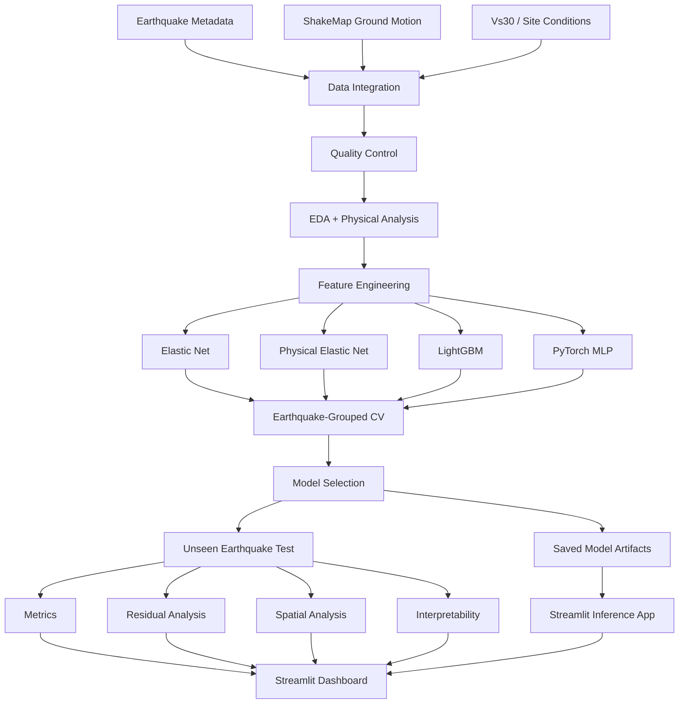

# System Architecture

## Core Principle

The split is performed at the **earthquake-event level** rather than the observation level.

This reduces event-level leakage and makes the final evaluation substantially more representative of deployment on a new earthquake.
